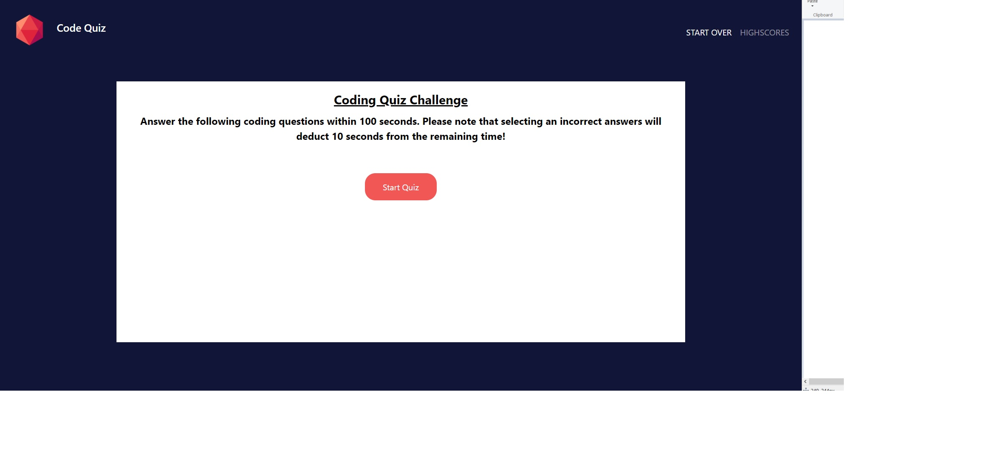
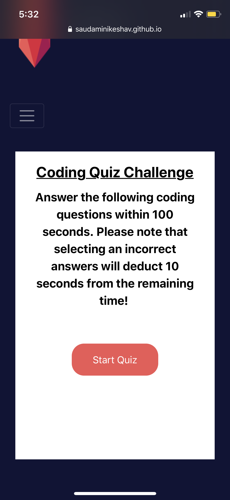
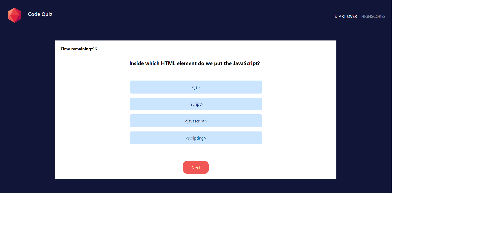
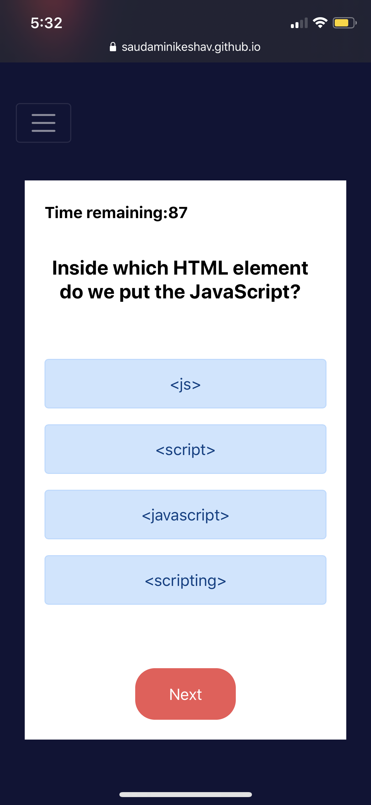
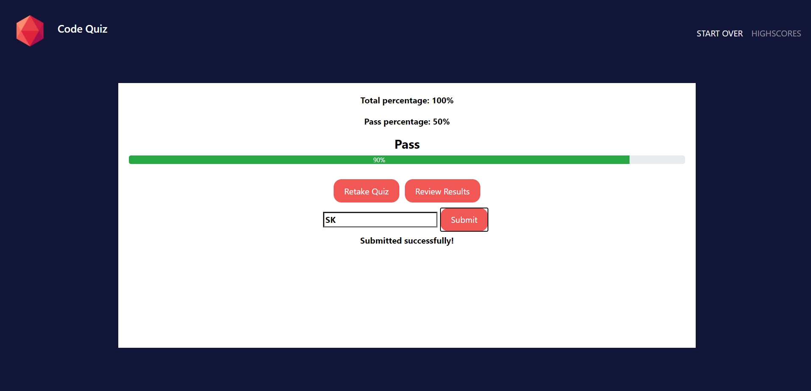
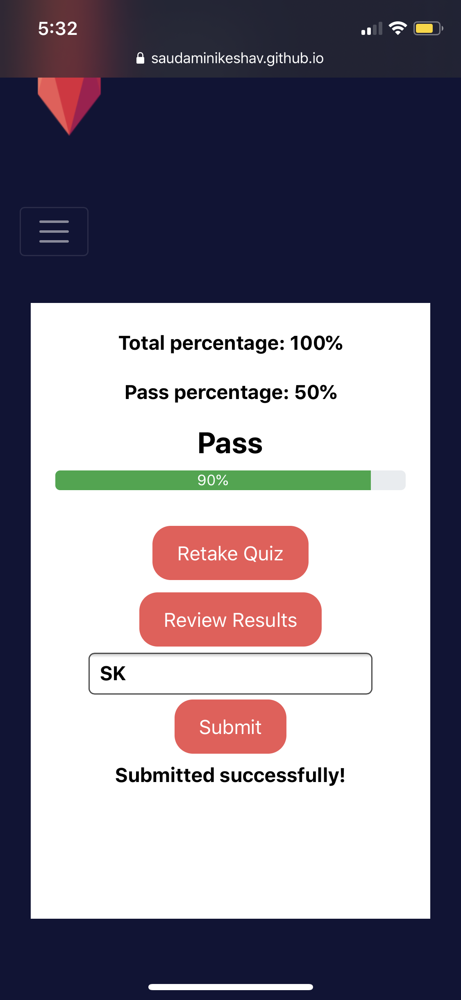
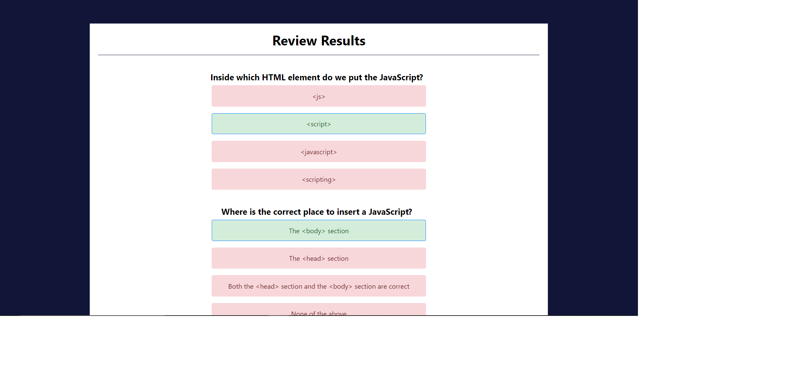
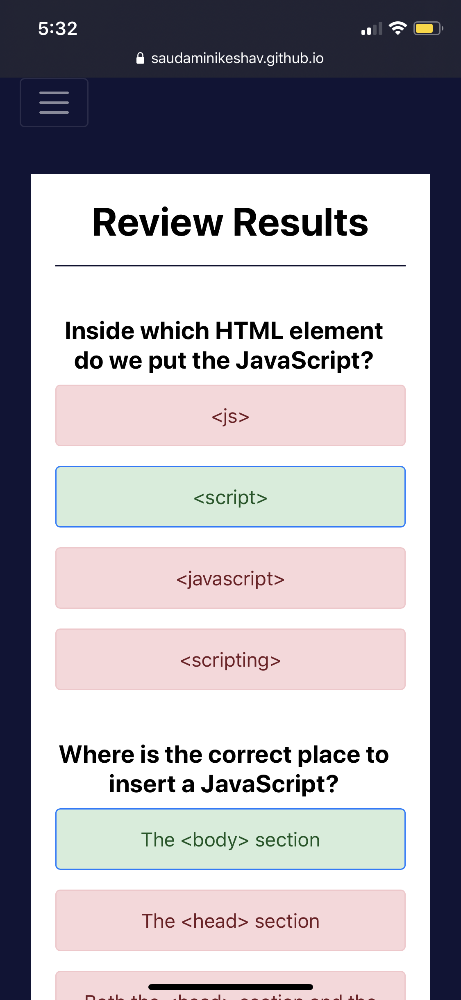
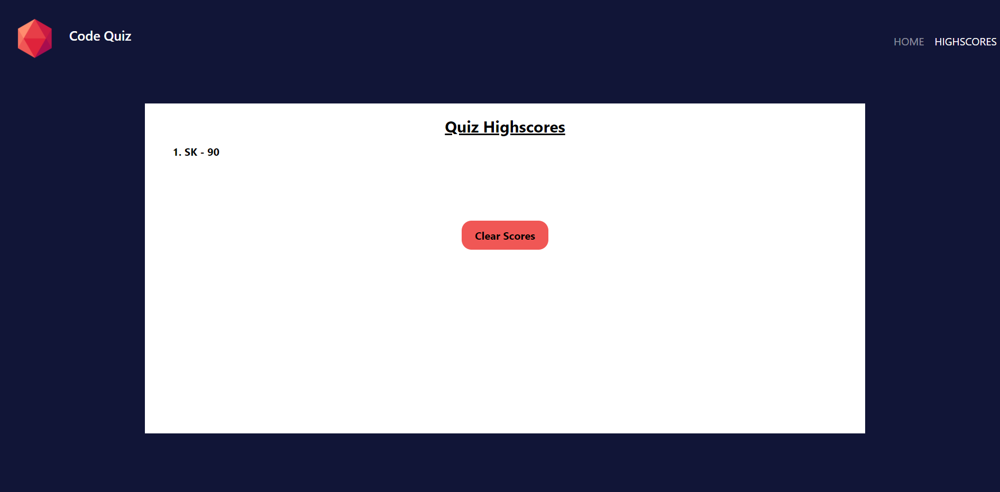
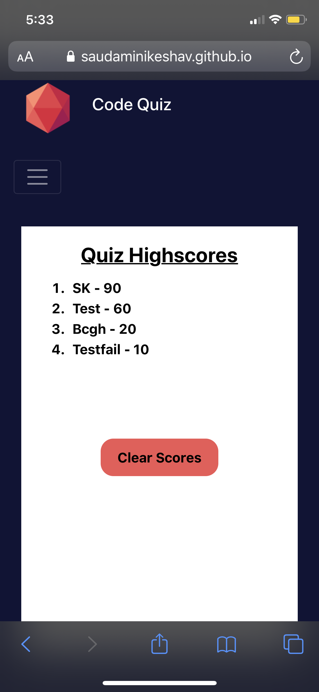

# Code-Quiz
04 Web APIs: Code Quiz

# 04 Web APIs: Code Quiz

As you proceed in your career as a web developer, you will probably be asked to complete a coding assessment, which is typically a combination of multiple-choice questions and interactive challenges. Build a timed code quiz with multiple-choice questions. This app will run in the browser and feature dynamically updated HTML and CSS powered by your JavaScript code. It will also feature a clean and polished user interface and be responsive, ensuring that it adapts to multiple screen sizes.

## User Story

```
AS A coding bootcamp student
I WANT to take a timed quiz on JavaScript fundamentals that stores high scores
SO THAT I can gauge my progress compared to my peers
```

## Acceptance Criteria

```
GIVEN I am taking a code quiz
WHEN I click the start button
THEN a timer starts and I am presented with a question
WHEN I answer a question
THEN I am presented with another question
WHEN I answer a question incorrectly
THEN time is subtracted from the clock
WHEN all questions are answered or the timer reaches 0
THEN the game is over
WHEN the game is over
THEN I can save my initials and score
```

The following animation demonstrates the application functionality:


### Review

You are required to submit the following for review:

* The URL of the functional, deployed application.

* The URL of the GitHub repository. Give the repository a unique name and include a README describing the project.

### Video of the completed Code quiz web application


### Images of the completed responsive Code quiz web application on desktop and mobile device

## Code Quiz start page



## Code Quiz questions page



## Code Quiz score page



## Code Quiz summary page



## Code Quiz highscore page



- - -
© 2019 Trilogy Education Services, a 2U, Inc. brand. All Rights Reserved.
